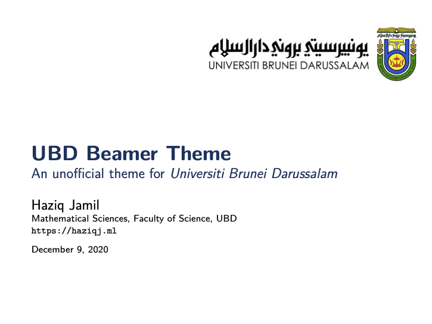
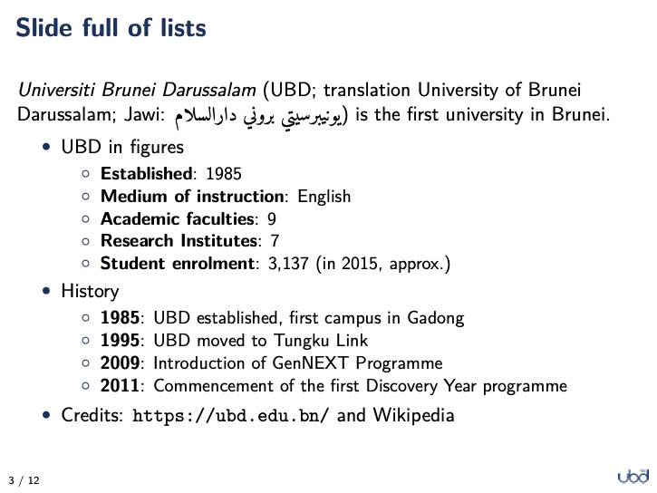
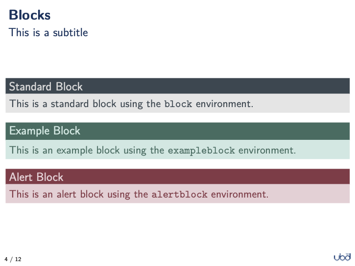
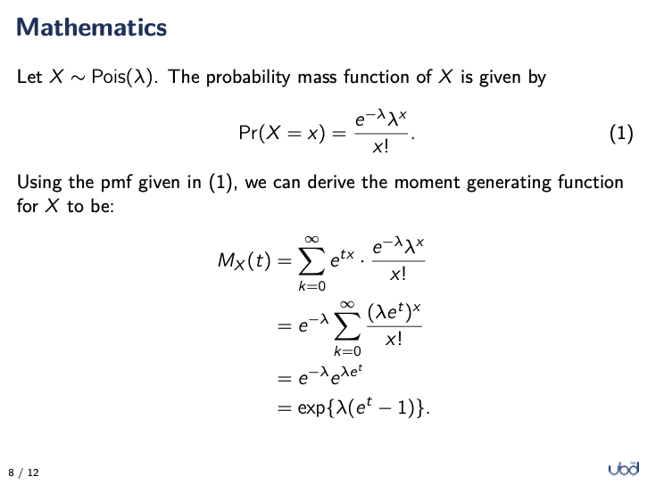
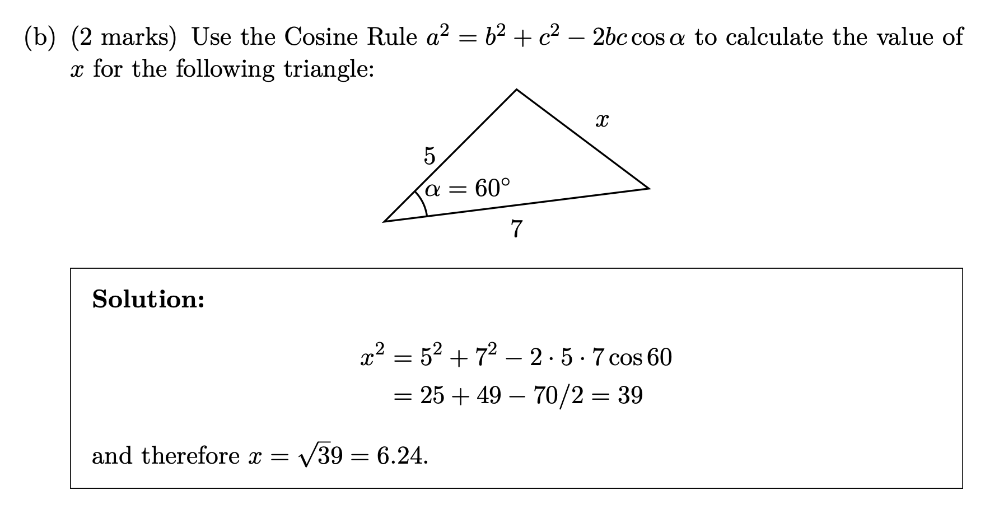
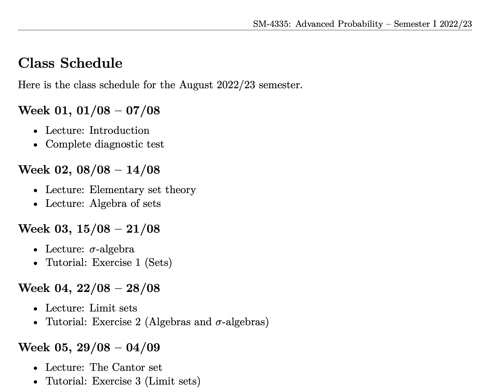

# Quality Typography in Teaching Material

# https://haziqj.ml/learn-latex

## TLC Workshop

- Speaker: [Haziq Jamil](https://haziqj.ml)
- Date: Wednesday, 23 Nov 2022
- Time: 2.00pm -- 4.00pm
- Venue: Online (MS Teams)

Additional instructions:

> Please be reminded to [<u>sign up</u>](https://www.overleaf.com/register) for an account on Overleaf.com.  **Dual device/monitors** are recommended for best experience in this online workshop.

## Workshop Poll

Goes live on the day of workshop.

<!-- 

 -->

## Abstract

Have you heard of LaTeX, the software system for document preparation? Unlike MS Word or Google Docs, the user uses plain text to prepare the document programmatically, which, in turn, is compiled by the LaTeX program into PDF format. This roundabout way of things has its advantages: LaTeX produces consistent document layouts allowing you to focus on content; makes bibliography and referencing a breeze; and facilitates typesetting of mathematical equations. LaTeX has been adopted across a wide variety of academic fields as a means of communicating and publishing scientific documents. It’s also a valuable tool for teaching material preparation (e.g. lecture slides, posters, exam papers, etc.), particularly for mathematical-based subjects. In this interactive workshop, we will learn the basics of LaTeX using the free online platform Overleaf.com. The primary learning outcome is for participants to be able to typeset a short article-style paper containing equations, figures, tables, and a bibliography. No prior programming knowledge is assumed.

## Learning outcomes

> **The target sample document: [PDF](sample-article.pdf)**--a completely artificial and made up paper using [SciGen](https://www.npmjs.com/package/scigen).

- Use Overleaf to typeset text in LaTeX
- Use different LaTeX commands
- Typeset beautiful mathematics
- Use several evnvironments (figures, tables, lists)
- Load LaTeX packages for extra functionality
- Structure an `article` document class
- Cross-reference parts of an article
- Insert bibliography automatically

## Exercises

1. Typesetting a simple paragraph: [link](https://www.overleaf.com/docs?snip_uri=https://raw.github.com//haziqj/learn-latex/main/exercises/01-getting_started/01-getting_started.tex&splash=none)

2. Learn to typeset a mathematical equation: [link](https://www.overleaf.com/docs?snip_uri=https://raw.github.com//haziqj/learn-latex/main/exercises/02-mathematics/02-mathematics.tex&splash=none)

3. Adding figures to a document: [link](https://www.overleaf.com/docs?snip_uri=https://raw.github.com//haziqj/learn-latex/main/exercises/03-figures/03-figures.tex&splash=none)

4. Structuring an article document: [link](https://www.overleaf.com/docs?snip_uri=https://raw.github.com//haziqj/learn-latex/main/exercises/04-article/04-article.tex&splash=none)

5. Automatic bibliography: [zip](https://github.com/haziqj/learn-latex/raw/main/exercises/05-bibliography.zip) -- to be uploaded to Overleaf as a new project

## Showcase

### Presentations using beamer class

If you have a lot of mathematical notations to present or would just like to create beautiful presentation slides using LaTeX, consider exploring the [beamer](https://www.overleaf.com/learn/latex/Beamer_Presentations%3A_A_Tutorial_for_Beginners_(Part_1)—Getting_Started) class.

  <kbd>
  
  
  
  
  </kbd>

I have created an unofficial beamer [*theme*](https://github.com/haziqj/ubd-beamer) designed for Universiti Brunei Darussalam, featuring a minimalistic design and a pastel-ised palette taken from UBD's colours.
The workshop slides was created using this theme.

### Exams class

Using the [`exams`](https://www.overleaf.com/learn/latex/Typesetting_exams_in_LaTeX) class, we can typeset exam questions and solutions in a single latex file. 
Then, using the `answers` toggle as an option, we can either typeset the exam paper only, or print out the solutions as well.

<kbd>
  
</kbd>

Download a sample test paper from my SM-2401 module: [Test paper](samples/sm2401_2020s1,t1.pdf) and [Solutions](samples/sm2401_2020s1,t1_soln.pdf)

### Syllabus document

One of the powers of LaTeX is being able to programmatically typeset a document.
That means, with a certain template, one may create and recreate the document under different circumstances.
As an example, for syllabus documents the schedule template remains the same but the start date of the semester changes every time.

<kbd>
  
</kbd>

Download a sample syllabus document from my SM-4335 module: [Syllabus](samples/sm4335-syllabus.pdf) 

