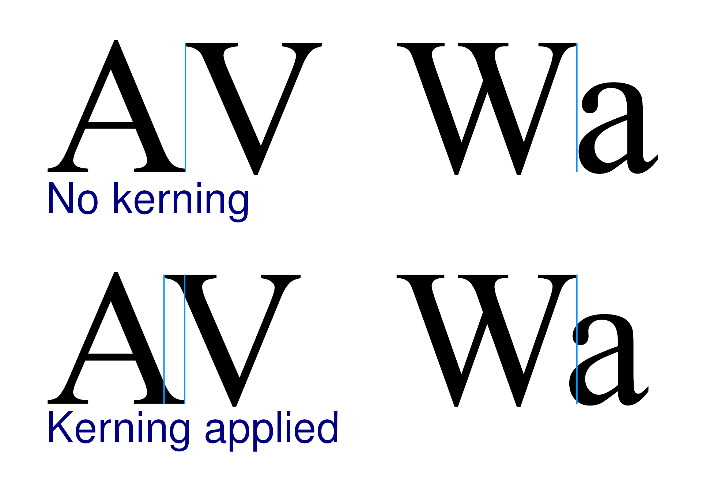
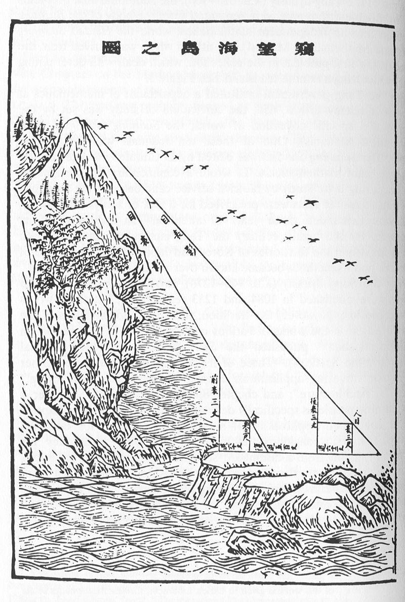
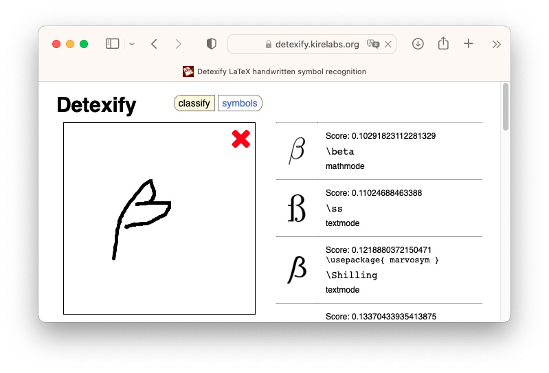
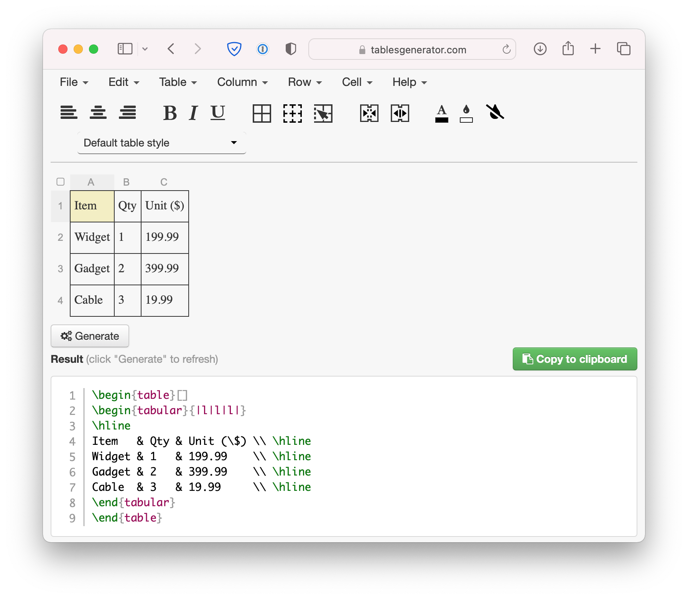
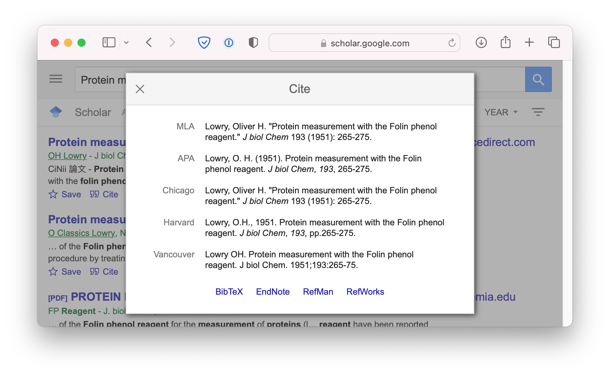

```{r setup, include = FALSE}
knitr::opts_chunk$set(
  echo = FALSE, fig.height = 3.2, fig.width = 6, cache = TRUE, out.width = "100%",
  cache.path = "_cache/", fig.path = "figure/", warning = FALSE, message = FALSE,
  fig.align = "center"
)
library(tidyverse)
library(directlabels)
options(width = 55)  # if 4:3 set to 55, otherwise 70
navyblue <- "#002f5c"
solidpink <- "#8E3B46"
```


# Introduction


### Why \LaTeX?

\vspace{-0.5em}

```{r kerning, out.height = "50%"}

```

\vspace{-0.5em}

- It makes [\underline{beautiful}](https://nitens.org/w/latex/) documents (kerning, ligatures, [\underline{hyphenation}](https://tex.stackexchange.com/questions/110133/visual-comparison-between-latex-and-word-output-hyphenation-typesetting-ligat)).

- Open source and active community. Lots of packages available.

- Extensible document types (articles, presentation slides, books, theses, exam papers, etc.).

::: {.alertblock latex="{Reminder}"}
Sign up for Overleaf if you haven't done so!
:::


## How does it work?

- You write your document in `plain text` with commands that describe its structure and meaning.

- The \LaTeX\ program then processes your text and commands to produce a beautifully formatted document.

```latex
The rain in Spain falls \emph{mainly} on the plain.
```

```{=latex}
\centering
\vskip 1ex
\tikz\node[single arrow,fill=gray,font=\ttfamily\bfseries,%
  rotate=270,xshift=-1em]{latex};
\vskip 1ex
\begin{center}\Large
The rain in Spain falls \emph{mainly} on the plain.
\end{center}
```

\blfootnote{This workshop is inspired by the \LaTeX\ course by 
\href{https://github.com/jdleesmiller/latex-course}{JD Miller}. MIT license.}

### More examples of commands and output...

\vspace{-1.5em}

::: {.columns}

::: {.column width=48%}
```latex
\begin{itemize}
  \item Tea
  \item Milk
  \item Biscuits
\end{itemize}
```
:::

::: {.column width=48%}

\vspace{2em}

\begin{itemize}
\item Tea
\item Milk
\item Biscuits
\end{itemize}

:::

:::

::: {.columns}

::: {.column width=48%}
```latex
\begin{figure}
  \includegraphics{gerbil}
\end{figure}
```
:::

::: {.column width=48%}

\begin{figure}
\includegraphics{gerbil}*
\end{figure}
:::

:::


::: {.columns}

::: {.column width=48%}
```latex
\begin{equation}
y = \alpha + \beta x
\end{equation}
```
:::

::: {.column width=48%}

\vspace{2.5em}

\begin{equation}
y = \alpha + \beta x
\end{equation}
:::

:::


\blfootnote{*Image license: \href{https://pixabay.com/en/animal-apple-attractive-beautiful-1239390/}{CC0}}

### Attitude adjustment

- Use commands to describe 'what it is' and not 'how it looks'.

- Focus on your content.

- Let \LaTeX\ do its job.

```{r latexgraph, fig.height = 2.9}
tibble(
  x = seq(1, 10, length = 100),
  " LaTeX" = 6 + 6 * log(x),
  " Word\n processor" =  1 + exp(x / 1.5)
) %>%
  pivot_longer(c(" LaTeX", " Word\n processor"), names_to = "type",
               values_to = "effort") %>%
  ggplot(aes(x, effort, col = type)) +
  geom_line(size = 1) +
  scale_y_continuous(limits = c(0, 32), breaks = NULL,
                     name = "Time and effort") +
  scale_x_continuous(breaks = seq(1, 10, length = 5), name = "Document type",
                     labels = c("Letters", "Essays", "Papers", "Theses", "Books")) +
  guides(col = "none") +
  coord_cartesian(xlim = c(1, 10.7)) +
  theme_classic() +
  scale_colour_viridis_d(begin = 0.2, end = 0.8, option = "A") -> p
  direct.label(p, "last.points")
```

## Showcasing \LaTeX

### Float placements

\LaTeX\ takes care of figure placements ("floats") automatically.

::: {.columns}

::: {.column width=64%}
```{r piechart, fig.height = 3.2, fig.width = 4.3}
tibble(
  group = LETTERS[1:2],
  value = c(98, 2)
) %>% ggplot(aes(x = "", y = value, fill = group)) +
  geom_bar(stat = "identity", width = 1) +
  coord_polar("y", start = 0) +
  scale_fill_viridis_d(name = NULL, labels = c(
    "You mess up\nthe whole\ndocument\n",
    "It actually\ndoes what\nyou want\n"
  ), guide = guide_legend(override.aes = list(size = 1)),
  begin = 0.2, end = 0.8, option = "A") +
  # scale_fill_manual(values = rev(iprior::gg_col_hue(2)),
  #                   name = NULL, labels = c(
  #   "You mess up\nthe whole\ndocument\n",
  #   "It actually\ndoes what\nyou want\n"
  # ), guide = guide_legend(override.aes = list(size = 1))) +
  labs(title = "Moving a picture in MS Word") +
  theme_void() 
```
:::

::: {.column width=33%}


\vspace{2em}

\begin{figure}
\frame{\includegraphics[width=\linewidth]{figure/tweet_msword.pdf}}
\end{figure}

:::

:::

### Citations

\justifying
Sometimes, however, what others tell us is important as *corroboration* of what we have already found out (or think we have found out) for ourselves.
The Scottish philosopher Thomas Reid makes this point in connection with mathematical research in the belief that, if it applies to the science 'in which, of all sciences, authority is acknowledged to have least weight' \cite{reid2002thomas}, it will be even more significant in other areas of thought and practice\ldots
Russell, as we shall see in a later chapter, considered this aspect of our reliance upon testimony essential to the understanding of what it is to be a physical thing and he criticized logical positivism for its failure to appreciate the implications of this point \cite{russell2007logic}.
In the Analysis of Matter he says explicitly, 'I mean here by "objective" not anything metaphysical but merely "agreeing with the testimony of others"' \cite{russell2015analysis}.

\vspace{1em}

Excerpt from *Testimony: A Philosophical Study* by C. A. J. Coady (1992)

### Bibliography

\nocite{coady1992testimony}
\printbibliography[heading=none]

### Mathematics

For $i=1,\dots,n$, let 
\begin{equation}\label{mod1}
\begin{gathered}
y_i = f(x_i) + \epsilon_i \\
(\epsilon_1,\dots,\epsilon_n)^\top \sim \N_n(0, \Psi^{-1}),
\end{gathered}
\end{equation}
where $y_i\in\bbR$, $x_i\in\mathcal X$, and $f\in\mathcal F$ a reproducing kernel Hilbert space (RKHS) of functions with kernel $h:\mathcal X \times \mathcal X \to \mathbb R$.

::: {.lemma name="Fisher information for regression function"}
\label{thm:fisherinformation}
For the normal model \eqref{mod1} with log-likelihood $\ell$, the Fisher information for $f$ is
\begin{equation}
\cI_f = -\E\nabla^2 \ell(f|y) = \sum_{i=1}^n\sum_{j=1}^n \psi_{ij}h(\cdot,x_i) \otimes h(\cdot,x_j) \label{eq:fisherinfo}
\end{equation}
where '$\otimes$' is the tensor product of two vectors in $\mathcal F$.
:::

The  bilinear form \eqref{eq:fisherinfo} in Lemma \ref{thm:fisherinformation} is a consequence of variational calculus.

<!-- ::: {.theorem name="Central Limit Theorem"} -->
<!-- \label{thm:clt} -->
<!-- Let $X_1,\dots,X_n$ be an independent random sample from a distribution whose mean is $\mu$ and variance is $\sigma^2$. -->
<!-- Then $\bar X_n := \frac{1}{n}\sum_{i=1}^n X_i$ converges in distribution to a random variable whose density function is -->
<!-- \begin{equation} -->
<!-- \label{eq:clt} -->
<!-- f(x) = \frac{1}{\sqrt{2\pi}} \exp\left[ -\frac{1}{2}\left(\frac{x - \mu}{\sigma/\sqrt n} \right)^2 \right] -->
<!-- \end{equation} -->
<!-- ::: -->

<!-- The proof of Theorem \ref{thm:clt} uses *characteristic functions*, whereby the standardised version of \eqref{eq:clt} is obtained in the limit as $n\to\infty$. -->

### Chemical equations

\begin{figure}
    \centering
    \small
    \fbox{
    \schemestart
        \chemname{
            \chemfig{
                CH
                (-[:90]CH_2-OOC-R_1)
                (-[:-90]CH_2-OOC-R_3)
                -OOC-R_2
            }
        }{Triglyceride}
        \+
        \chemname{
                \chemfig{
                    3 ROH
                }
            }{Alcohol}
        \arrow(.mid east--.mid west){<=>[Catalyst]}
        \chemname{
            \chemfig{
                R_2
                (-[:90,,,,draw=none]R_1-COO-R)
                (-[:-90,,,,draw=none]R_3-COO-R)
                -COO-R
            }
        }{Alkyl esters}
        \+
        \chemname{
            \chemfig{
                CH
                (-[:90]CH_2-OH)
                (-[:-90]CH_2-OH)
                -OH
            }
        }{Glycerol}
    \schemestop
    }
    \vspace{0.5em}
    \caption{Transesterification of triglyceride with alcohol.}
    \label{scm:tsester}
\end{figure}

\blfootnote{Figure \ref{scm:tsester} obtained from \url{https://tex.stackexchange.com/a/472486}}

### Multilingual support


\vspace{-2em}

::: {.columns}

::: {.column width=48%}
\justifying
```{r aljabr, out.height = "45%"}

```

\textarabic{
الْكِتَابْ الْمُخْتَصَرْ فِيْ حِسَابْ الْجَبْرْ وَالْمُقَابَلَة
} (The Compendious Book on Calculation by Completion and Balancing), also known as \textarabic{الجبر} (Al-Jabr), written by \textarabic{
محمد بن موسى الخوارزميّ
} (Muḥammad ibn Mūsā al-Khwārizmī) around 820 CE.
:::

::: {.column width=48%}
\justifying
```{r haidao, out.height = "45%"}

```

海岛算经 (Hǎidǎo suàn jīng--The Sea Island Mathematical Manual) was written by 刘徽 (Liú Huī) ca. 200 CE. The Chinese were aware of a good approximation of $\pi\approx$ $355/113$ $= 3.1415929204$ very early on (祖冲之 Zǔ Chōng Zhī, 500 CE).
:::

:::

## For teaching and learning

- Setting of question papers (assignments, tests, exams, etc.)
- Syllabus documents
- Presentations
- Academic posters

# Getting started

\framesubtitle{A minimal \LaTeX\ document}

```latex
\documentclass{article}
\begin{document}
Hello, World!  % your content goes here...
\end{document}
```

- Commands start with a backslash \framebox{\texttt{\textbackslash}}.

- Every document starts with a `\documentclass`{.latex} command.

- The *argument* in curly braces \framebox{\texttt{\{}}  \framebox{\texttt{\}}} tells \LaTeX\ what kind of document we are creating (in this case, an `article`).

- A percent sign `%` starts a *comment*--\LaTeX\ will ignore the rest of the line.

### Getting started


```{r overleaf, out.width = "50%"}
knitr::include_graphics("figure/overleaf.png")
```

::: {.center latex=""}
https://www.overleaf.com/
:::


- Overleaf is a website for writing documents in \LaTeX.

- It 'compiles' your \LaTeX\ document online to show you the results.

- As we go through the following slides, try out the examples by typing them into the example document on Overleaf!


:::: {.varblock latex="{Exercise 0 (Hello world)}"}

Click
\href{https://www.overleaf.com/docs?snip_uri=https://raw.github.com//haziqj/learn-latex/main/exercises/00-hello_world/00-hello_world.tex&splash=none}{\beamerbutton{Hello World}}
to open the "Hello world" document in **Overleaf**
(you'll need to sign in first).
Let's get started!

::::


### Typesetting text

- Type your text between `\begin{document}`{.latex} and `\end{document}`{.latex}.

- For the most part, you can just type your text normally.

::: {.columns}

::: {.column width=48%}
\vspace{-1em}
```latex
Words are separated by one
or more spaces.

Paragraphs are separated by
one or more blank lines.
```
:::

::: {.column width=48%}

Words are separated by one
or more spaces.

\vspace{1.2em}

Paragraphs are separated by
one or more blank lines.
:::

:::

\vspace{0.5em}

- Blank space in the source file is collaped in the output.


::: {.columns}

::: {.column width=48%}
\vspace{-1em}
```latex
The      rain    in   Spain
falls mainly on the   plain.
```
:::

::: {.column width=48%}
The      rain    in   Spain
falls mainly on the   plain.
:::

:::

### Typesetting text (Caveats)

- Quotation marks are a bit tricky: Use a backtick \framebox{\texttt{`}} on the left and an apostrophe \framebox{\texttt{'}} on the right.

::: {.columns}

::: {.column width=48%}
\vspace{-1em}
```latex
Single quotes: `text'.

Double quotes: ``text''.
```
:::

::: {.column width=48%}
Single quotes: 'text'.

\vspace{1.2em}

Double quotes: "text".
:::

:::

\vspace{0.5em}

- Some common characters have special meanings in \LaTeX :

    - \framebox{\texttt{\%}} is used to comment text
    - \framebox{\texttt{\#}} is used for macros definitions
    - \framebox{\texttt{\&}} is used for alignment
    - \framebox{\texttt{\$}} is used for maths

- If you just type these, you'll get an error. If you want one to appear in the output, you have to *escape* it by preceding it with a backslash \framebox{\texttt{\textbackslash}}.

::: {.columns}

::: {.column width=48%}
\vspace{-1em}
```latex
\$ \% \& \#
```
:::

::: {.column width=48%}
$ % & #
:::

:::

### Handling errors

- \LaTeX\ can get confused when it is trying to compile your document. If it does, it stops with an error, which you must fix before it will produce any output.

- For example, if you misspell `\emph`{.latex} as `\meph`{.latex}, \LaTeX\ will stop with an `undefined control sequence` error, because `\meph`{.latex} is not one of the commands it knows.

::: {.block latex="{Advice on errors}"}

1. Don't panic! Errors happen. The error messages can give a clue as to what's wrong.

2. Fix them as soon as they arise--if what you just typed caused an error, you can start your debugging there.

3. If there are multiple errors, start with the first one--the cause may even be above it.

:::

### Exercise


:::: {.varblock latex="{Exercise 1 (Typesetting Text)}"}

Typeset the following paragraph\footnote{\url{http://en.wikipedia.org/wiki/Economy_of_the_United_States}} in \LaTeX :
<!-- Typeset the following paragraph^[http://en.wikipedia.org/wiki/Economy_of_the_United_States] in \LaTeX : -->

> In March 2006, Congress raised that ceiling an additional $0.79 trillion to $8.97 trillion, which is approximately 68% of GDP. As of October 4, 2008, the “Emergency Economic Stabilization Act of 2008” raised the current debt ceiling to $11.3 trillion.


Click
\href{https://www.overleaf.com/docs?snip_uri=https://raw.github.com//haziqj/learn-latex/main/exercises/01-getting_started/01-getting_started.tex&splash=none}{\beamerbutton{Exercise 1}}
to open this exercise in **Overleaf**.

::::

Watch out for

- characters with special meanings  \framebox{\texttt{\%}} \framebox{\texttt{\#}} \framebox{\texttt{\&}} \framebox{\texttt{\$}}

- typesetting quotation marks correctly.

# Mathematics

## Inline equations

- Dollar signs \framebox{\texttt{\$}}  are used to mark mathematics in text.

::: {.columns}

::: {.column width=48%}
\small
\vspace{-1em}
```latex
% not so good:
Let a and b be distinct positive
integers, and let c = a - b + 1.

% much better:
Let $a$ and $b$ be distinct
positive integers, and let
$c = a - b + 1$.
```
:::

::: {.column width=48%}
\vspace{1em}
Let a and b be distinct positive
integers, and let c = a - b + 1.

\

Let $a$ and $b$ be distinct positive
integers, and let $c = a - b + 1$.
:::

:::

\vspace{0.5em}

- Always use dollar signs in pairs--one to **begin** and one to **end**.

- \LaTeX\ handles spacing automatically; it ignores your spaces.

::: {.columns}

::: {.column width=48%}
\small
\vspace{-1.1em}
```latex
Let $y=mx+c$ be \ldots

Let $y = m x + c$ be \ldots
```
:::

::: {.column width=48%}
Let $y=mx+c$ be \ldots

\vspace{1.2em}

Let $y = m x + c$ be \ldots
:::

:::

### More notation

- Use caret/hat \framebox{\ \texttt{\^}} for superscripts and underscore \framebox{$\vphantom{a}$\texttt{\_}} for subscripts.

::: {.columns}

::: {.column width=58%}
\small
\vspace{-1em}
```latex
$y = c_2 x^2 + c_1 x + c_0$
```
:::

::: {.column width=38%}
$y = c_2 x^2 + c_1 x + c_0$
:::

:::

\vspace{0.5em}

- Use curly braces \framebox{\texttt{\{}}  \framebox{\texttt{\}}} to group supers/sub scripts.

::: {.columns}

::: {.column width=58%}
\small
\vspace{-1em}
```latex
% oops!
$F_n = F_n-1 + F_n-2$

% ok!
$F_n = F_{n-1} + F_{n-2}$
```
:::

::: {.column width=38%}
\vspace{1em}

$F_n = F_n-1 + F_n-2$

\vspace{2em}

$F_n = F_{n-1} + F_{n-2}$
:::

:::

\vspace{0.5em}

- There are commands for Greek letters and common notation.

::: {.columns}

::: {.column width=58%}
\small
\vspace{-1em}
```latex
$\mu = A e^{Q/RT}$

$\Omega = \sum_{k=1}^{n} \omega_k$
```
:::

::: {.column width=38%}
$\mu = A e^{Q/RT}$

\vspace{1em}

$\Omega = \sum_{k=1}^{n} \omega_k$
:::

:::

### Detexify

\centering
\vspace{-0.5em}
<!-- ```{r detexify} -->
<!--  -->
<!-- ``` -->

[](https://detexify.kirelabs.org/classify.html)

## Displayed equations

- If the mathematics is big and scary, *display* it on its own line using `\begin{equation}`{.latex} and `\end{equation}`{.latex}


::: {.columns}

::: {.column width=58%}
\small
\vspace{-1.1em}
```latex
The roots of a quadratic equation are
given by
\begin{equation}
x = \frac{-b \pm \sqrt{b^2 - 4ac}}
         {2a}
\end{equation}
where $a$, $b$ and $c$ are \ldots
```
:::

::: {.column width=38%}
The roots of a quadratic equation are given by
\begin{equation}
x = \frac{-b \pm \sqrt{b^2 - 4ac}}
{2a} \end{equation}
where $a$, $b$ and $c$ are \ldots
:::

:::

\vspace{0.5em}

::: {.alertblock latex="{Caution}"}
\LaTeX\ mostly ignores your spaces in mathematics, but it can’t handle blank lines in equations--don’t put blank lines in your mathematics.
:::


## Interlude: Environments

- `equation` is an *environment* (a context).

- The `\begin`{.latex} and `\end`{.latex} commands are used to create many different environments. E.g., `itemize` and `enumerate` for lists:


::: {.columns}

::: {.column width=58%}
\small
\vspace{-1em}
```latex
\begin{itemize} % for bullet points
\item Biscuits
\item Tea
\end{itemize}

\begin{enumerate} % for numbers
\item Biscuits
\item Tea
\end{enumerate}
```
:::

::: {.column width=38%}
\vspace{1em}
- Biscuits
- Tea

\vspace{2.5em}

1. Biscuits
2. Tea

:::

:::

## Interlude: Packages

- All of the commands and environments we’ve used so far are built into \LaTeX .

- *Packages* are libraries of extra commands and evironments. There are thousands of freely available packages.

- We have to load each package we want to use with a `\usepackage`{.latex} commands in the *preamble*.

- Example: `amsmath` from the American Mathematical Society.

```latex
\documentclass{article}
\usepackage{amsmath} % preamble
\begin{document}
% now we can use commands from amsmath here...
\end{document}
```

### An example with `amsmath`

- Align a sequence of equations at the equals sign
\begin{align*}
(x+1)^3 &= (x+1)(x+1)(x+1) \\
        &= (x+1)(x^2 + 2x + 1) \\
        &= x^3 + 3x^2 + 3x + 1
\end{align*}
with the `align*` environment.

\small

```latex
\begin{align*}
(x+1)^3 &= (x+1)(x+1)(x+1) \\
        &= (x+1)(x^2 + 2x + 1) \\
        &= x^3 + 3x^2 + 3x + 1
\end{align*}
```

\normalsize

- An ampersand  \framebox{\texttt{\&}} separates the left column (before the '$=$') from the right column (after the '$=$').

- A double backslash  \framebox{\texttt{\textbackslash\textbackslash}} starts a new line.


### Exercise

:::: {.varblock latex="{Exercise 2 (Maths)}"}

Typeset the following paragraph in \LaTeX :

> Let $X_1, X_2, \dots, X_n$ be a sequence of independent and identically
distributed random variables with mean $\mu$ and
variance $\sigma^2 < \infty$, and let
\begin{equation}
S_n = \frac{1}{n}\sum_{i=1}^{n} X_i
\end{equation}
denote their mean. Then as $n$ approaches infinity, the random variables
$\sqrt{n}(S_n - \mu)$ converge in distribution to a normal $N(0, \sigma^2)$.


Click
\href{https://www.overleaf.com/docs?snip_uri=https://raw.github.com//haziqj/learn-latex/main/exercises/02-mathematics/02-mathematics.tex&splash=none}{\beamerbutton{Exercise 2}}
to open this exercise in **Overleaf**.

::::


# Figures

- Requires the `graphicx` package, which provides the `\includegraphics`{.latex} command.

- Supported graphics formats include JPEG, PNG and PDF.


::: {.columns}

::: {.column width=68%}
\small
\vspace{-1em}
```latex
\includegraphics{gerbil}


\includegraphics[width=0.3\textwidth,
                 angle=270]{gerbil}
                 
                 
```
:::

::: {.column width=28%}
\includegraphics[width=\textwidth]{figure/gerbil}

\includegraphics[width=0.5\textwidth,angle=270]{figure/gerbil}
:::

:::

## Interlude: Optional arguments

- We use square brackets \framebox{\texttt{[}}  \framebox{\texttt{]}} for *optional* arguments, instead of braces  \framebox{\texttt{\{}}  \framebox{\texttt{\}}}.

- `\includegraphics`{.latex} accepts optional arguments that allow you to transform the image when it is included. For example, `width=0.3\textwidth`{.latex} makes the image take up 30% of the width of the surrounding text (`\textwidth`{.latex}).

- `\documentclass`{.latex} accepts optional arguments, too. E.g. `\documentclass[12pt,twocolumn]{article}`{.latex} makes the text bigger (12pt) and puts it into two columns.

### Floats 

- Allow \LaTeX\ to decide where the figure will go (it can "float").

- You can also give the figure a caption, which can be referenced with `\ref`{.latex}.

- For more on floats, visit [this link](https://www.overleaf.com/learn/latex/Positioning_images_and_tables).

::: {.columns}

::: {.column width=60%}
\small
\vspace{-1em}
```latex
\begin{figure}[htbp]
\centering 
\includegraphics[%
width=0.5\textwidth]{gerbil} 
\caption{\label{fig:gerbil}Aww\ldots.} 
\end{figure}

Figure \ref{fig:gerbil} shows a gerbil.
```
:::

::: {.column width=36%}
\vspace{-1em}
```{r gerbilcap, fig.cap = "Aww\\ldots"}
knitr::include_graphics("figure/gerbil.jpg")
```

\vspace{-0.5em}
Figure \ref{fig:gerbilcap} shows a gerbil.
:::

:::

## Interlude: Tables

- Use the `tabular` environment wrapped in the `table` environment tht floats it. You can also `\caption` and `\label` to `\ref` it later.


::: {.columns}

::: {.column width=48%}
\footnotesize
\vspace{-1em}
```latex
\begin{table}[htbp]
\begin{tabular}{|l|l|l|}
\hline
Item   & Qty & Unit (\$) \\ \hline
Widget & 1   & 199.99    \\ \hline
Gadget & 2   & 399.99    \\ \hline
Cable  & 3   & 19.99     \\ \hline
\end{tabular}
\caption{My table}
\label{tab:mytab}
\end{table}
```
:::

::: {.column width=48%}

```{=latex}
\begin{table}[htbp]
\begin{tabular}{|l|c|r|}
\hline
Item   & Qty & Unit (\$) \\ \hline
Widget & 1   & 199.99    \\ \hline
Gadget & 2   & 399.99    \\ \hline
Cable  & 3   & 19.99     \\ \hline
\end{tabular}
\caption{My table}
\label{tab:mytab}
\end{table}
```

:::

:::

\vspace{0.5em}

- The argument specifies column alignment--**l**eft, **c**entre, **r**ight.

- `\hline`{.latex} and \framebox{\texttt{|}}  specifies horizontal and vertical lines resp.

- Use \framebox{\texttt{\&}} to separate columns and \framebox{\texttt{\textbackslash\textbackslash}} to start new line.

### Tablesgenerator.com

\centering

[](https://www.tablesgenerator.com)

### Exercise

:::: {.varblock latex="{Exercise 3 (Figures)}"}

Let's practice adding a picture using `\begin{figure}...\end{figure}`{.latex} and `\includegraphics`{.latex}. Download the following image by clicking on it.

```{=latex}
\href{https://github.com/haziqj/learn-latex/raw/main/figure/gerbil.jpg}{%
\begin{center}
\includegraphics[height=10cm]{figure/gerbil.jpg}
\end{center}
}
```

Click
\href{https://www.overleaf.com/docs?snip_uri=https://raw.github.com//haziqj/learn-latex/main/exercises/03-figures/03-figures.tex&splash=none}{\beamerbutton{Exercise 3}}
to open this exercise in **Overleaf**.

::::


# Structure

## Title, author, date

- Tell \LaTeX\ the `\title`{.latex} and `\author`{.latex} names in the preamble. Note that author names are separated by `\and`{.latex}.

- The `\date` command can be used to manually specify the date, or use `\date{\today}`{.latex} for today's date.

- Then use `\maketitle`{.latex} (inserted just after `\begin{document}`{.latex}) to actually create the title.


::: {.columns}

::: {.column width=53%}
\small
\vspace{-1em}
```latex
\documentclass{article}

\title{The Title}
\author{A. Author \and A. Nother}
\date{\today}

\begin{document} 
\maketitle
\end{document}
```
:::

::: {.column width=43%}

```{r maketitle}
knitr::include_graphics("figure/maketitle.pdf")
```
:::

:::

## Abstract

- Typically, a paper begins with the abstract.

- Use the `abstract` environment for this.

::: {.columns}

::: {.column width=53%}
\small
\vspace{-1em}
```latex
\documentclass{article}
\usepackage{lipsum}  % load this 
\title{The Title}
\author{A. Author \and A. Nother}
\date{\today}

\begin{document} 
\maketitle

\begin{abstract}
\lipsum[1]  % placeholder text
\end{abstract}

\end{document}
```
:::

::: {.column width=43%}

```{r abstract}
knitr::include_graphics("figure/abstract.pdf")
```
:::

:::

## Sections

- To section the document, use `\section`{.latex} and `\subsection`{.latex}.


::: {.columns}

::: {.column width=53%}
\small
\vspace{-1em}
```latex
\documentclass{article} 
\begin{document}

\section{Introduction}
The problem of \ldots 

\subsection{Sample Preparation} 

\subsection{Data Collection}

\section{Results}

\section{Conclusion}

\end{document}
```
:::

::: {.column width=43%}

```{r sections}
knitr::include_graphics("figure/sections.pdf")
```
:::

:::

### Cross-referencing

- As with equations, figures and tables, it is possible to cross-reference the sections. Just use `\label`{.latex} and `\ref`{.latex}.


::: {.columns}

::: {.column width=53%}
\footnotesize
\vspace{-1em}
```latex
\documentclass{article} 
\begin{document}

\section{Introduction}
Results are presented in section 
\ref{sec:results}.
In section \ref{sec:conc}, we conclude.

\section{Results}
\label{sec:results}

\section{Conclusion}
\label{sec:conc}

\end{document}
```
:::

::: {.column width=43%}

```{r crossref}
knitr::include_graphics("figure/crossref.pdf")
```

:::

:::


### Exercise

:::: {.varblock latex="{Exercise 4 (Structure)}"}

The document you will load contains all the text, but its structure is missing.
Go ahead and fix this:

- Add title, author and date.
- Add the abstract.
- Add sections.
- Cross reference the sections.

\vspace{1em}

Click
\href{https://www.overleaf.com/docs?snip_uri=https://raw.github.com//haziqj/learn-latex/main/exercises/04-article/04-article.tex&splash=none}{\beamerbutton{Exercise 4}}
to open this exercise in **Overleaf**.

::::


# Bibliography

## The bibtex format

- \LaTeX\ works off a 'bibtex' database format:

```latex
@article{lowry1951protein,
  title={Protein measurement with the Folin phenol reagent},
  author={Lowry, OH and Rosebrough, NJ and Farr, AL and 
          Randall, RJ},
  journal={Journal of Biological Chemistry},
  volume={193},
  pages={265--275},
  year={1951}
}
```

- Each bibtex entry has a *key* that you can use to reference it in the document. E.g., `lowry1951protein` is the key for the article above.

- It’s a good idea to use a key based on the name, year and title.


### A bib file

- Collect all your references into a bib file, say `refs.bib`. This file should be in the folder together with your tex file.

- Most reference managers (e.g. Mendeley or Zotero) can export to bibtex format.

- You can also use Google Scholar and do this manually.

```{r googlescholar, out.width = "72%"}

```

### Bib\LaTeX

- Use the `biblatex` package with the `natbib` option.

- The bibliography file must be called using  `\addbibresource`{.latex}.

- At the end, print the bibliography using `\printbibliography`{.latex}.


::: {.columns}

::: {.column width=53%}
\small
\vspace{-1em}
```latex
\documentclass{article} 
\usepackage[natbib]{biblatex} 
\addbibresource{refs.bib}
% if 'refs' is the name of 
% the bib file

\begin{document}
The most cited paper ever is 
\cite{lowry1951protein}.

\printbibliography
\end{document}
```
:::

::: {.column width=43%}

```{r biblatex1}
knitr::include_graphics("figure/biblatex1.pdf")
```

:::

:::

## Citation styles

- Use the optional argument `style` to change the citation style.


::: {.columns}

::: {.column width=53%}
\small
\vspace{-1em}
```latex
...

\usepackage[natbib,stype=apa]
  {biblatex} 

...
```
:::

::: {.column width=43%}

\vspace{-1em}

```{r biblatex2}
knitr::include_graphics("figure/biblatex2.pdf")
```

:::

:::

\vspace{0.5em}

- A number of citation styles exist:

   - `numeric`: (default) Numeric citation scheme
   - `apa`: American Psychological Association
   - `ieee`: Institute of Electrical and Electronics Engineers
   - `chicago`: Chicago style
   - `mla`: Modern Language Association

### Some `natbib` commands

- The `natbib` option allows several alternative citation commands, useful when using an author-year style such as the APA style.


::: {.columns}

::: {.column width=53%}
\small
\vspace{-1em}
```latex
% Textual citation
\citet{lowry1951protein}	

% Textual citation, all authors
\citet*{lowry1951protein}	

% Parenthetical citation
\citep{lowry1951protein}	

% Prints only the author name
\citeauthor{lowry1951protein}	

% Prints only the year 
\citeyear{lowry1951protein}	
```
:::

::: {.column width=43%}

```{r natbib}
knitr::include_graphics("figure/natbib.pdf")
```

:::

:::

### Exercise


:::: {.varblock latex="{Exercise 5 (Bibliography)}"}

We will add citations to the previous document.
To get started, download the zip file which contains all the files you need by clicking  \href{https://github.com/haziqj/learn-latex/raw/main/exercises/05-bibliography.zip}{\beamerbutton{Exercise 5}}.
**Do not unzip the zip file.**
Instead, upload it to Overleaf.

\vspace{-0.5em}

```{r upload, out.width = "50%"}

```

\vspace{-1.5em}
::::


# What's next?

### Wrap-up

```{=latex}
\begin{center}
\begin{tikzpicture}
\node[anchor=south west,inner sep=0] (image) at (0,0) {\includegraphics[width=0.7\textheight]{figure/confetti.png}};
\node[align=center,black,font={\Huge}] at (image.center) {CONGRATS!};
\end{tikzpicture}
\end{center}
```

You have now learned how to...

- Typeset text in \LaTeX
- Use lots of different commands
- Typeset some beautiful mathematics
- Use several different environments (figures, tables, lists).
- Load packages
- Structure an article
- Cross-reference parts of the article
- Insert bibliography automatically

### Ready for more?

- [\underline{Overleaf}](https://www.overleaf.com/for/community/resources) is a great resource for learning \LaTeX: 

::: {.center latex=""}

[{ width=45% }](https://assets.ctfassets.net/nrgyaltdicpt/4e825etqMUW8vTF8drfRbw/d4f3d9adcb2980b80818f788e36316b2/A_quick_guide_to_LaTeX__Overleaf_version.pdf)

:::

- Other document classes

   1. Typesetting `exams`: [link](https://www.overleaf.com/learn/latex/Typesetting_exams_in_LaTeX)
   2. Making presentations using `beamer`: [link](https://www.overleaf.com/learn/latex/Beamer_Presentations%3A_A_Tutorial_for_Beginners_(Part_1)—Getting_Started)
   3. Write your own `book`: [link](https://www.overleaf.com/gallery/tagged/book)
   4. Drawing with `tikz`: [link](http://texample.net/tikz/) 
   

- Unofficial UBD `beamer` theme: [link](https://github.com/haziqj/ubd-beamer)

- Need to convert to docx? Consider [pandoc](https://pandoc.org).
```bash
pandoc mydoc.tex -o mydoc.docx
```

### RMarkdown

- Maybe next time: Reproducible documents using [RMarkdown](https://rmarkdown.rstudio.com).


::: {.columns}

::: {.column width=48%}
\small
\vspace{-1em}
````{verbatim, lang = "markdown", echo = TRUE}
We write text in **Markdown**
language.

- Tea
- Milk
- Biscuits

```{r}
1 + 1
```

The content can contain inline 
code like
`r round(pi * exp(1), 2)`, too.
````

:::

::: {.column width=43%}

We write text in **Markdown** language.

- Tea
- Milk
- Biscuits

```{r, echo = TRUE, eval = TRUE}
1 + 1
```

The content can contain inline 
code like
`r round(pi * exp(1), 2)`, too.

:::

:::


