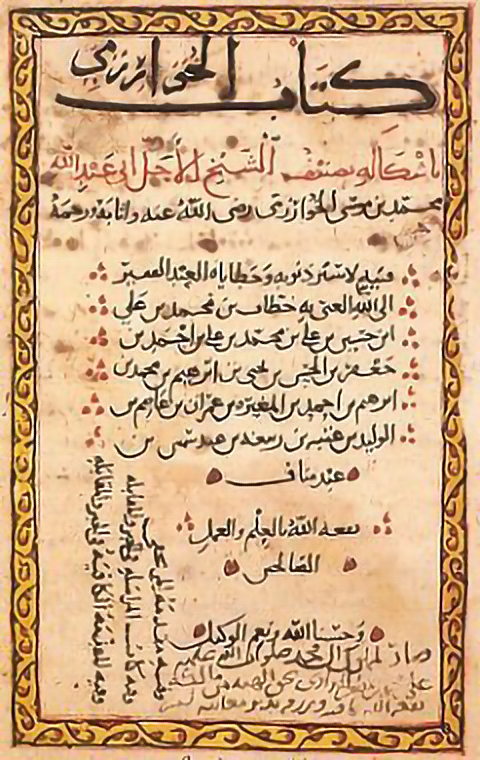

```{r setup, include = FALSE}
knitr::opts_chunk$set(
  echo = FALSE, fig.height = 3.2, fig.width = 6, cache = TRUE,
  cache.path = "_cache/", fig.path = "figure/", warning = FALSE, message = FALSE,
  fig.align = "center"
)
library(tidyverse)
library(directlabels)
options(width = 55)  # if 4:3 set to 55, otherwise 70
navyblue <- "#002f5c"
solidpink <- "#8E3B46"
```


# Hello World


### Why \LaTeX? 

- It makes beautiful documents

- Open source and active community. Lots of packages available.

- Extensible document types (articles, presentation slides, books, theses, exam papers, etc.)

### How does it work?

- You write your document in `plain text` with commands that describe its structure and meaning.

- The \LaTeX program then processes your text and commands to produce a beautifully formatted document.

```tex
The rain in Spain falls \emph{mainly} on the plain.
```

::: {.center latex=""}
The rain in Spain falls \emph{mainly} on the plain.
:::

### More examples of commands and output...


::: {.columns}

::: {.column width=48%}
```latex
\begin{itemize}
  \item Tea
  \item Milk
  \item Biscuits
\end{itemize}
```
:::

::: {.column width=48%}

\vspace{2em}

\begin{itemize}
\item Tea
\item Milk
\item Biscuits
\end{itemize}

:::

:::


::: {.columns}

::: {.column width=48%}
```latex
\begin{figure}
  \includegraphics{gerbil}
\end{figure}
```
:::

::: {.column width=48%}

\begin{figure}
\includegraphics{gerbil}
\end{figure}
:::

:::


::: {.columns}

::: {.column width=48%}
```latex
\begin{equation}
y = \alpha + \beta x
\end{equation}
```
:::

::: {.column width=48%}

\vspace{2.5em}

\begin{equation}
y = \alpha + \beta x
\end{equation}
:::

:::

### Attitude adjustment

- Use commands to describe 'what it is' and not 'how it looks'

- Focus on your content

- Let \LaTeX\ do its job

\vspace{0.5em}

```{r latexgraph, fig.height = 3}
tibble(
  x = seq(1, 10, length = 100),
  " LaTeX" = 6 + 6 * log(x),
  " Word\n processor" =  1 + exp(x / 1.5)
) %>%
  pivot_longer(c(" LaTeX", " Word\n processor"), names_to = "type", 
               values_to = "effort") %>%
  ggplot(aes(x, effort, col = type)) +
  geom_line(size = 1) +
  scale_y_continuous(limits = c(0, 32), breaks = NULL, 
                     name = "Time and effort") +
  scale_x_continuous(breaks = seq(1, 10, length = 5), name = "Document type",
                     labels = c("Letters", "Essays", "Papers", "Theses", "Books")) + 
  guides(col = "none") +
  coord_cartesian(xlim = c(1, 10.7)) +
  theme_classic() +
  scale_colour_viridis_d(begin = 0.2, end = 0.8, option = "A") -> p
  direct.label(p, "last.points")
```

### Things that it solves: Picture alignment/placement

\LaTeX\ takes care of figure placements automatically.

::: {.columns}

::: {.column width=64%}
```{r piechart}
tibble(
  group = LETTERS[1:2],
  value = c(98, 2)
) %>% ggplot(aes(x = "", y = value, fill = group)) +
  geom_bar(stat = "identity", width = 1) +
  coord_polar("y", start = 0) +
  scale_fill_viridis_d(name = NULL, labels = c(
    "You mess up\nthe whole\ndocument\n",
    "It actually\ndoes what\nyou want\n"
  ), guide = guide_legend(override.aes = list(size = 1)),
  begin = 0.2, end = 0.8, option = "A") +
  # scale_fill_manual(values = rev(iprior::gg_col_hue(2)),
  #                   name = NULL, labels = c(
  #   "You mess up\nthe whole\ndocument\n",
  #   "It actually\ndoes what\nyou want\n"
  # ), guide = guide_legend(override.aes = list(size = 1))) +
  labs(title = "Moving a picture in MS Word") +
  theme_void() 
```
:::

::: {.column width=33%}


\vspace{2em}

\begin{figure}
\frame{\includegraphics[width=\linewidth]{figure/tweet_msword.pdf}}
\end{figure}

:::

:::


### Things that it solves: References and bibliography

Sometimes, however, what others tell us is important as *corroboration* of what we have already found out (or think we have found out) for ourselves.
The Scottish philosopher Thomas Reid makes this point in connection with mathematical research in the belief that, if it applies to the science 'in which, of all sciences, authoritiy is acknowledges to have least weight' \cite{reid2002thomas}, it will be even more significant in other areas of thought and practice... Russell, as we shall see in a later chapter, considered this aspect of our reliance upon testimony essential to the understanding of what it is to be a physical thing and he criticized logical positivism for its failure to appreciate the implications of this point \cite{russell2007logic}.
In the Analysis of Matter he says explicitly, `I mean here by "objective" not anything metaphysical but merely "agreeing with the testimony of others"' \cite{russell2015analysis}.

\vspace{1em}

Excerpt from *Testimony: A Philosophical Study* by C. A. J. Coady (1992)

### References

\nocite{coady1992testimony}
\printbibliography[heading=none]


### Things that it solves: Mathematical equations

Typesetting mathematics and equation referencing.

\vspace{1em}

\hrule

\vspace{0.5em}

::: {.theorem name="Central Limit Theorem"}
\label{thm:clt}
Let $X_1,\dots,X_n$ be an independent random sample from a distribution whose mean is $\mu$ and variance is $\sigma^2$. 
Then $\bar X_n := \frac{1}{n}\sum_{i=1}^n X_i$ converges in distribution to a random variable whose density function is
\begin{equation}
\label{eq:clt}
f(x) = \frac{1}{\sqrt{2\pi}} \exp\left[ -\frac{1}{2}\left(\frac{x - \mu}{\sigma/\sqrt n} \right)^2 \right]
\end{equation}
:::

The proof of Theorem \ref{thm:clt} uses *charactertistic functions*, whereby the standardised version of \eqref{eq:clt} is obtained in the limit.

  <!-- \ce{2LiOH_{(s)} + CO_{2(g)} -> Li_{2}CO_{3(s)} + H_{2}O_{(g)}} -->

### A chemistry example

\begin{figure}
    \centering
    \small
    \schemestart
        \chemname{
            \chemfig{
                CH
                (-[:90]CH_2-OOC-R_1)
                (-[:-90]CH_2-OOC-R_3)
                -OOC-R_2
            }
        }{Triglyceride}
        \+
        \chemname{
                \chemfig{
                    3 ROH
                }
            }{Alcohol}
        \arrow(.mid east--.mid west){<=>[Catalyst]}
        \chemname{
            \chemfig{
                R_2
                (-[:90,,,,draw=none]R_1-COO-R)
                (-[:-90,,,,draw=none]R_3-COO-R)
                -COO-R
            }
        }{Alkyl esters}
        \+
        \chemname{
            \chemfig{
                CH
                (-[:90]CH_2-OH)
                (-[:-90]CH_2-OH)
                -OH
            }
        }{Glycerol}
    \schemestop
    \caption{Transesterification of triglyceride with alcohol.}
    \label{scm:tsester}
\end{figure}

\blfootnote{Figure \ref{scm:tsester} obtained from \url{https://tex.stackexchange.com/a/472486}}

### Languages

\vspace{-2em}

::: {.columns}

::: {.column width=48%}

```{r aljabr, out.width = "40%"}

```

\textarabic{
الْكِتَابْ الْمُخْتَصَرْ فِيْ حِسَابْ الْجَبْرْ وَالْمُقَابَلَة
} (The Compendious Book on Calculation by Completion and Balancing), also known as \textarabic{الجبر} (Al-Jabr), written by \textarabic{
محمد بن موسى الخوارزميّ
} (Muḥammad ibn Mūsā al-Khwārizmī) around 820 CE.
:::

::: {.column width=48%}

```{r haidao, out.width = "40%"}

```

海岛算经 (Hǎidǎo suàn jīng--The Sea Island Mathematical Manual) was written by 刘徽 (Liú Huī) ca. 200 CE. The Chinese were aware of a good approximation of $\pi\approx$ $355/113$ $= 3.1415929204$ very early on (祖冲之 Zǔ Chōng Zhī, 500 CE).
:::

:::

### For teaching

- Setting of question papers (assignments, tests, exams, etc.)
- Syllabus documents
- Presentations 


# Getting started


### Getting started

\framesubtitle{A minimal \LaTeX\ document}

```latex
\documentclass{article}
\begin{document}
Hello, World!  % your content goes here...
\end{document}
```

- Commands start with a backslash `\`

- Every document starts with a `\documentclass` command

- The *argument* in curly braces `{` `}` tells \LaTeX\ what kind of document we are creating (in this case, an `article`)

- A percent sign `%` starts a *comment*--\LaTeX\ will ignore the rest of the line


### Getting started

\framesubtitle{Overleaf}

- Overleaf is a website for writing documents in \LaTeX

- It 'compiles' your \LaTeX\ document automatically to show you the results

- As we go through the following slides, try out the examples by typing them into the example document on Overleaf!


### Exercises

1. Familiarising
2. Article
3. Mathematics
4. Figures
5. Referencing


